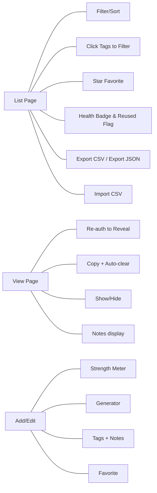

# PasswordManagement — v3 Extended Documentation

This document covers **new features**, **system & application diagrams**, **end-to-end workflows**, and **code walkthroughs** so you can learn, explain, and extend the app confidently.

---

## 1) What’s new in v3

- **Configurable password hashing**: choose `bcrypt` (default) or `argon2` via `security.encoder` property.  
- **CSV Import** for credentials (Site, Username, Password, Tags, Favorite, Notes).  
- **JSON Export** of all credentials (with decrypted password in the export file you download).  
- **Password age & activity timestamps**: `createdAt`, `lastUpdatedAt`, `lastViewedAt`, `passwordUpdatedAt` visible on list.  
- **Clickable tag filters** on the list view (click a tag badge to filter quickly).  
- **Docs updated** with diagrams & code flow.

> v2 features remain: server-synced **Notes**, **Favorites**, **Tags**, **Password Health**, **Reveal with re-auth**, **Auto-lock on idle**, **Clipboard auto-clear**, **Local notes export/import**.

---

## 2) System Diagram (Mermaid)

```mermaid
graph TD
  subgraph Browser
    V[Thymeleaf Views + Bootstrap + app.css/app.js]
  end

  subgraph SpringBoot[Spring Boot]
    C[Controllers]
CredentialController, AuthController
    S[Services]
CredentialService
CustomUserDetailsService
    R[Repositories]
UserRepository
CredentialRepository
    M[Entities]
AppUser
Credential
    Sec[SecurityConfig]
  end

  DB[(Database
H2/MySQL)]

  V <-- HTTP --> C
  C --> S
  S --> R
  R --> DB
  Sec --- C
```

---

## 3) Application Diagram (Features)



---

## 4) Request Workflows

### 4.1 List Credentials (`GET /credentials`)
1. Resolve current user, load items from `CredentialRepository.findByOwner`.
2. Compute **strengths** and **reusedIds** via `CredentialService`.
3. Render table with tags, health, timestamps, and actions.

### 4.2 Add Credential (`POST /credentials/add`)
1. Controller constructs `Credential` from form fields.
2. `CredentialService.encryptPassword` (AES‑GCM with random IV) is used.
3. `touchCreate` stamps timestamps → save.

### 4.3 View & Reveal Password
- **GET `/credentials/view/{id}`**: show masked; no plaintext on first load.  
- **POST `/credentials/view/{id}/reveal`**: verify account password with `PasswordEncoder.matches`; on success, decrypt password, set `lastViewedAt`, and re-render with `plainPassword` available for show/hide/copy.

### 4.4 Edit (`POST /credentials/edit/{id}`)
- Update fields; if password provided, re-encrypt and call `touchPasswordRotate`; always `touchUpdate` and save.

### 4.5 Export
- **CSV**: `/credentials/export` — simple spreadsheet-friendly output.
- **JSON**: `/credentials/export-json` — structured export (includes decrypted password for your copy).

### 4.6 Import CSV (`POST /credentials/import`)
- Accepts a CSV file with header `Site,Username,Password,Tags,Favorite,Notes`; parses into new items encrypted at rest.


---

## 5) Code Walkthrough (key classes)

### 5.1 `SecurityConfig`
- Adds property `security.encoder` (default `bcrypt`); when set to `argon2`, uses `Argon2PasswordEncoder.defaultsForSpringSecurity_v5_8()`.
- Restricts `/credentials/**` to authenticated users; permits `/login`, `/register`, and H2 Console.

### 5.2 `Credential` (Entity)
- Fields: `site`, `loginUsername`, `encryptedPassword`, `tags`, `notes`, `favorite`.
- Timestamps: `createdAt`, `lastUpdatedAt`, `lastViewedAt`, `passwordUpdatedAt`.
- `owner` (ManyToOne `AppUser`).

### 5.3 `CredentialService`
- `encryptPassword`/`decryptPassword`: AES‑GCM with random 12-byte IV; master key from `APP_MASTER_KEY` or fallback.
- `passwordStrength`, `strengthById`, `reusedPasswords` for UI signals.
- `touchCreate`, `touchUpdate`, `touchPasswordRotate` to maintain timestamps.

### 5.4 `CredentialController`
- **List**: computes health & reuse; passes to template.
- **Add/Edit**: now handles `tags`, `notes`, `favorite` and timestamps.
- **View/Reveal**: re-auth gate; updates `lastViewedAt` on successful reveal.
- **Export JSON** and **Import CSV** endpoints.
- **Toggle favorite** and search across site/login/tags/notes.

### 5.5 Frontend (`static/js/app.js`, `static/css/app.css`)
- Dark/light theme, table filter/sort, notes modal (local-only), copy actions (with auto-clear), idle auto-logout, password generator & strength meter, and **clickable tag badges** to filter quickly.

---

## 6) Configuration

```properties
# Choose the encoder: bcrypt | argon2
security.encoder=bcrypt

# In-memory H2 by default (or set MySQL env vars)
spring.h2.console.enabled=true
spring.jpa.hibernate.ddl-auto=update

# Optional: master key (Base64 for AES)
app.master-key=

# File uploads (CSV import)
spring.servlet.multipart.max-file-size=3MB
spring.servlet.multipart.max-request-size=3MB
```

---

## 7) Testing Checklist

- Register, login, add credentials with notes/tags/favorite.
- Reveal flow requires account password; clipboard clears after ~20s.
- List shows health, reused badge, timestamps; clicking tag filters the list.
- CSV Import (header present) → items appear in list.
- Export CSV & JSON match current data.
- Idle 5 minutes → auto logout.

---

## 8) Roadmap ideas (next)
- Switch authentication hashing to **Argon2id** by default (flip property) and implement **migration-on-login** to rehash old BCrypt.
- Breach-check integration, password rotation reminders.
- Browser extension & PWA offline vault.
- Shared vaults, RBAC, and audit log streaming.
